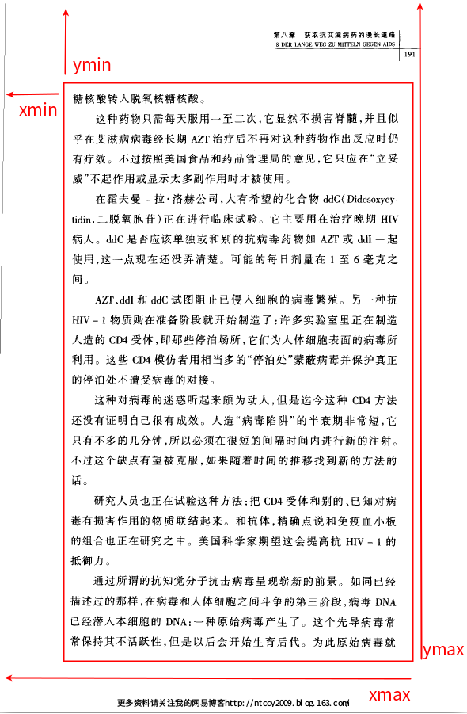

# Usage Description
## background description in English

In our daily life, sometimes we want to convert some pdf files to txt files, especially when these pdf files are old scanned version. As Tencent AI[ai.qq.com] provides a free common ocr api with good effect for developer, why cann't we use this to convert pdf to txt? This script is designed to finished this task.

Several days ago (before 2018.11.11), Professor Yan Feng asked a related question in Weibo. He asked if there is some free software that can convert scanned version PDF to txt. Together with the reason mentioned above, I decide to write such a script to do this task.

I would like this script to be as simple as I can. I don't know when could I finished this, but I will do it in free time.

## Usage Dependence

In this script, json, pillow and pdf2image are used. Linux user can install there packages with command 'pip install' or 'conda install'. Before installing package pdf2image, you should install poppler-utils with command 'sudo apt install poppler-utils'. You can find more details in this link[https://github.com/Belval/pdf2image].

For windows user, anaconda is recommended to install these packages. And to install poppler in windows, you can find the details in link[https://github.com/Belval/pdf2image].

## Pipeline Description

convert PDF to images-> rename images-> crop out useless margin in image -> invoke ocr api to convert image to json -> convert json file to txt file -> concatenate txt file into a bigger txt file

## Variable Setting

Before using this script, you should also set some variables.

- app_id&app_key：app id and app key for tencent general ocr api. Apply for related development permission in this link[ai.qq.com].

- image_dir/json_dir/txt_dir: Folders to save temporary image filess, json files and txt files. In default, You can ignore this.

- pdf_file: Pdf file needed to be converted. to save it in the save directory with the script.

- crop_area: Crop location. In some scanned version pdf, you may see watermark, header or footer in the paper. They will generate some noise in the process to convert image to json. To avoid this, you should set this variable to crop the margin.
The crop location is in the form of (xmin, ymin, xmax, ymax), which is left top x axis, left top y axis, right down x axis, right down y axis.

- method: When convrting a json file to txt file, we need to confirm if two adjacent lines belong to the same paragraph. If the paragraph in the pdf file has indentation, you should choose the 'space' method; or else you should chooose the 'interval' method, which means the script will use intervals between two lines to confirm.

- platform: The platform you are using. It is used to confirm the return character after each paragraph.You can chooose linux, windows or mac.

## Image crop demonstration

As shown in the picture below, before ocr you need to crop out the area outside the red line. The area within the the red line is actually what we need. Using software to get the x/y axis value, you will get the value of variable crop_area.

# 使用说明
## 中文背景说明

前几天（2018.11.11之前）严锋老师在微博上询问有没有什么软件可以完成扫描版PDF OCR转录成TXT的免费软件。从网友的回复来看，似乎仍然没有一款软件能满足上述的全部需求（免费且好用）。鉴于最近调用了腾讯的通用OCR API做文字识别，那么为什么不自己写个脚本完成这个任务呢？

况且在日常的生活中，我们经常会有需求需要将一些（盗版的）扫描PDF转录成更容易阅读和格式调整的纯文本格式。所以就有了这么一个小项目。

为了能够让更多的零基础的人进行使用，我会将代码书写的尽可能简洁。

## 使用依赖

本脚本中使用的库包括json，pillow和pdf2image等。linux用户可以通过pip install或者conda install的方式安装上述库。
在安装pdf2image之前，请安装sudo apt install poppler-utils。更为具体的安装须知请参考这里[https://github.com/Belval/pdf2image]。

对于windows用户而言，推荐使用anaconda进行库的安装。windows环境下的poppler的安装也请参考这里[https://github.com/Belval/pdf2image]。

## pipeline说明

PDF解析成图片-> 图片重命名-> 剪裁掉图片边缘-> 调用OCR识别API得到JSON文件-> 将JSON文件转为TXT文本-> 重组拼接TXT得到最终的TXT文件

## 参数设置

在使用本脚本之前，你需要设置的参数有：

- app_id&app_key：腾讯通用OCR识别api所需的app id和app key，申请流程请参阅官方文档[ai.qq.com]。

- image_dir/json_dir/txt_dir: 用于存储脚本运行流程中生成的缓存文件的文件夹（默认可以不设置）

- pdf_file: 你需要识别转换的PDF文件（需和当前脚本保持同一目录）

- crop_area: 需要剪裁的区域大小。由于某些扫描版本的pdf中存在额外添加的水印，为消除此水印以及页眉页脚带来的噪音干扰，请设定剪裁区域。剪裁区域的坐标分别为(左上角x轴数值，左上角y轴数值，右下角x轴数值，右下角y轴数值。)你可以使用shutter或者画图等软件进行像素值的确认。

- method: 从json转成txt的文件中，需要确认识别结果中紧邻两行是否属于同一个段落。如果PDF文件中的文字段落有缩进，请选择'space'；否则请选择'interval'，即通过行间距判断文字的归属。

- platform: 脚本运行平台，linux/windows/mac。用于确定在生成的文本中添加'\n'/'\r\n'/'\r'作为换行符。

## 图片剪裁示意图

如下图所示，你需要将正文的内容从PDF扫描页中剪裁出来；红框中的区域才是我们所需要的。通过相关软件确认了左上角和右下角的坐标点后即可得到crop_area参数。

